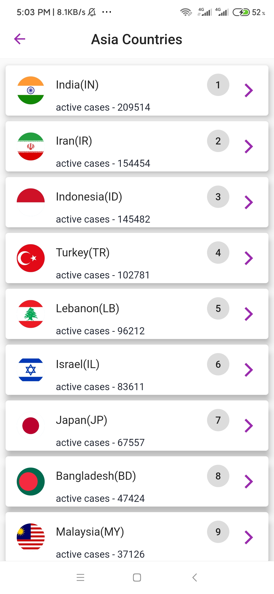
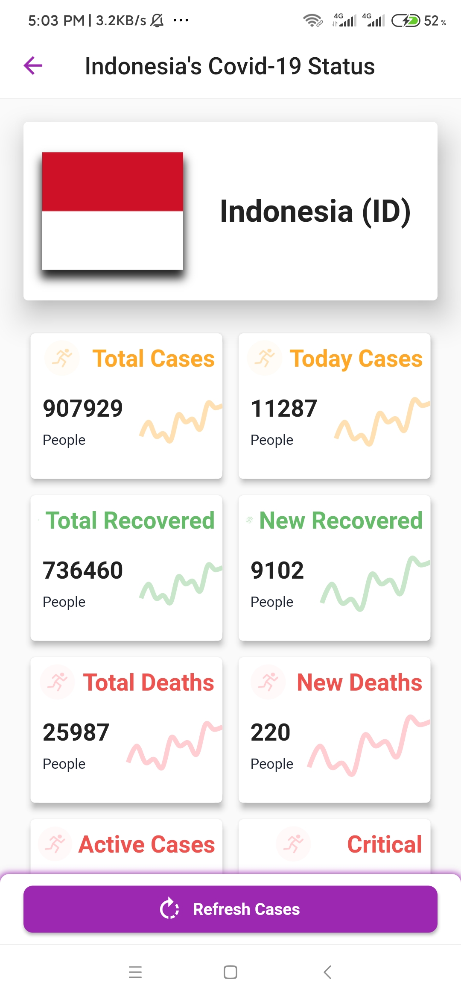
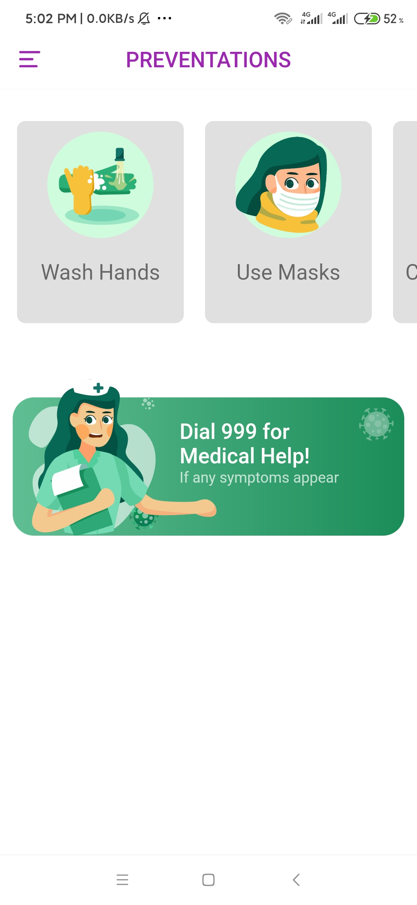

## NgaVitt🔥🔥 (Covid-19 Tracker App with Awesome UI)

#### Public API - https://corona.lmao.ninja/
#### UI inspired from [The Flutter Way](https://youtu.be/axWBN1aotQk)

#### Used Packages
<ul>
	<li><a href="https://pub.dev/packages/provider" style="text-decoration: none; color: blue;">provider</a></li>
	<li><a href="https://pub.dev/packages/http" style="text-decoration: none; color: blue;">http</a></li>
	<li><a href="https://pub.dev/packages/fl_chart" style="text-decoration: none; color: blue;">fl_chart</a></li>
	<li><a href="https://pub.dev/packages/flutter_svg" style="text-decoration: none; color: blue;">flutter_svg</a></li>
</ul>	

Star⭐ the repo if you like this 😉. 
Make a pull request to contribute with me 😉. 

#### Included Features
<ul>
	<li>splash screen while fetching data</li>
	<li>portable and better performance</li>
	<li>included total 220 countries</li>
	<li>pie chart status</li>
	<li>see countries as by their continents</li>
	<li>sorting countries by names, active and total cases</li>
	<li>sorting by ascending or descending order</li>
	<li>refresh indicator,refresh case butthon(better UX)</li>
	<li>included pie chart status for each country</li>
	<li>how to prevent screen</li>
</ul>

#### [Demo Video](https://youtu.be/cAxXZ1V7NiQ)

## 📸 ScreenShots
 
 
 
 
 
 

## 🤓 Author
**Hein Arkar** 
