## NgaVitt🔥🔥 (Covid-19 Tracker App with Awesome UI)

#### Public API - https://corona.lmao.ninja/
#### UI inspired from [The Flutter Way](https://youtu.be/axWBN1aotQk)

#### <a href="https://ngavitt.netlify.app/" style="text-decoration: none; color: blue;">DEMO WEB</a>

#### Used Packages
<ul>
	<li><a href="https://pub.dev/packages/provider" style="text-decoration: none; color: blue;">provider</a></li>
	<li><a href="https://pub.dev/packages/http" style="text-decoration: none; color: blue;">http</a></li>
	<li><a href="https://pub.dev/packages/fl_chart" style="text-decoration: none; color: blue;">fl_chart</a></li>
	<li><a href="https://pub.dev/packages/flutter_svg" style="text-decoration: none; color: blue;">flutter_svg</a></li>
	<li><a href="https://pub.dev/packages/animated_theme_switcher" style="text-decoration: none; color: blue;">animated_theme_switcher</a></li>
	<li><a href="https://pub.dev/packages/shared_preferences" style="text-decoration: none; color: blue;">shared_preferences</a></li>
	<li><a href="https://pub.dev/packages/google_fonts" style="text-decoration: none; color: blue;">google_fonts</a></li>
	<li><a href="https://pub.dev/packages/flutter_icons" style="text-decoration: none; color: blue;">flutter_icons</a></li>
	<li><a href="https://pub.dev/packages/quick_actions" style="text-decoration: none; color: blue;">quick_actions</a></li>
	<li><a href="https://pub.dev/packages/url_launcher" style="text-decoration: none; color: blue;">url_launcher</a></li>
	<li><a href="https://pub.dev/packages/url_launcher_web" style="text-decoration: none; color: blue;">url_launcher_web</a></li>
</ul>	

Star⭐ the repo if you like this 😉. 
Make a pull request to contribute with me 😉. 

#### Included Features
<ul>
	<li>splash screen while fetching data</li>
	<li>included total 220 countries</li>
	<li>pie chart status</li>
	<li>see countries as by their continents</li>
	<li>sorting countries by names, active and total cases</li>
	<li>sorting by ascending or descending order</li>
	<li>refresh indicator,refresh case butthon(better UX)</li>
	<li>included pie chart status for each country</li>
	<li>how to prevent screen</li>
	<li>portable and better performance</li>
</ul>

#### Newly Added Features
<ul>
    <li>dark mode support</li>
	<li>animated theme switcher</li>
	<li>added smooth animations</li>
	<li>support PWA</li>	
</ul>

## 📸 ScreenShots
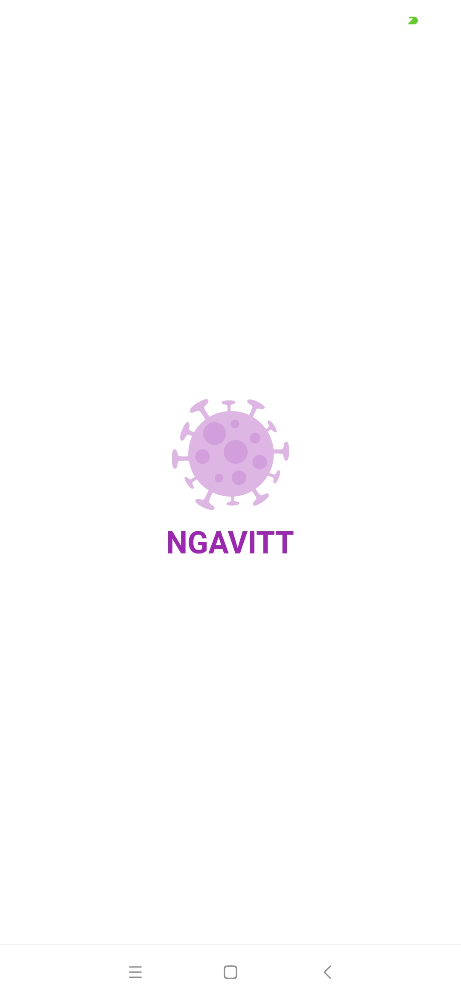 
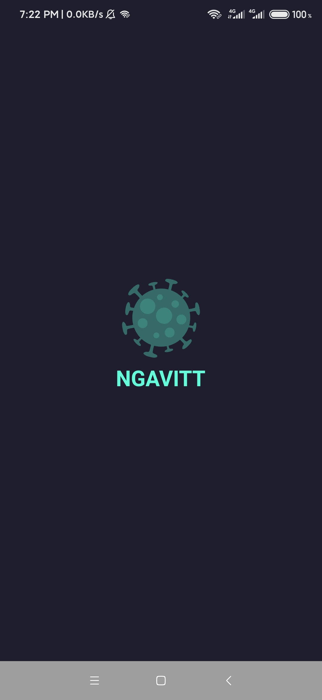

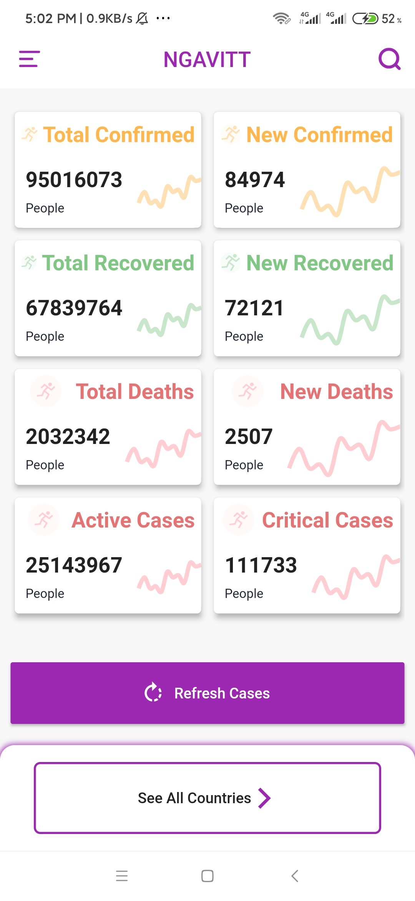 
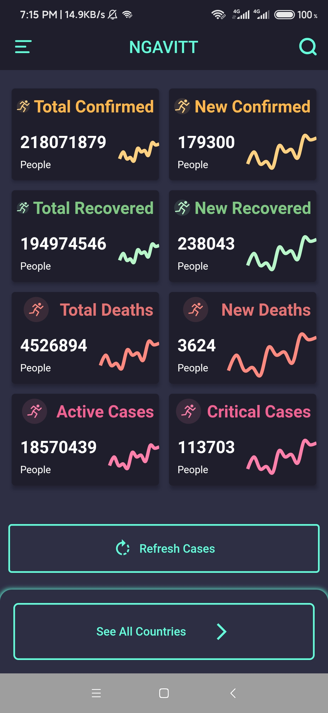 

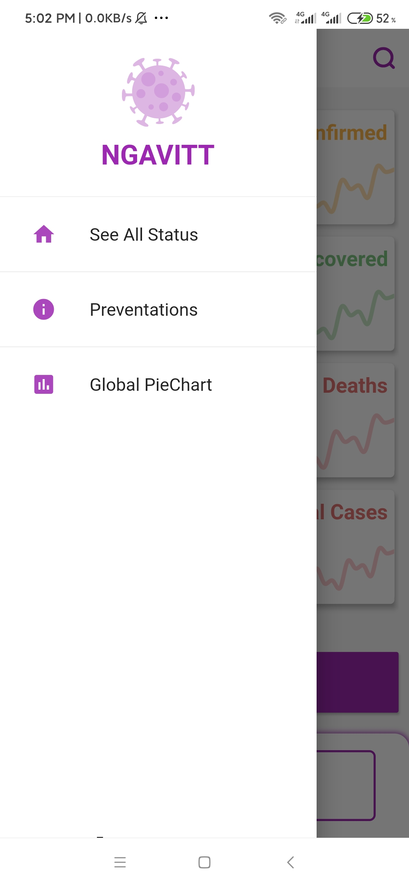 
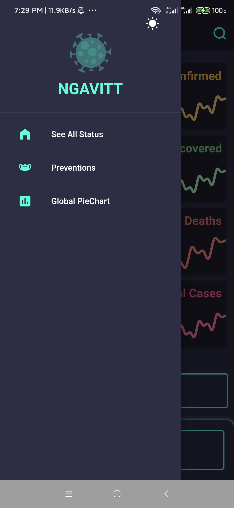

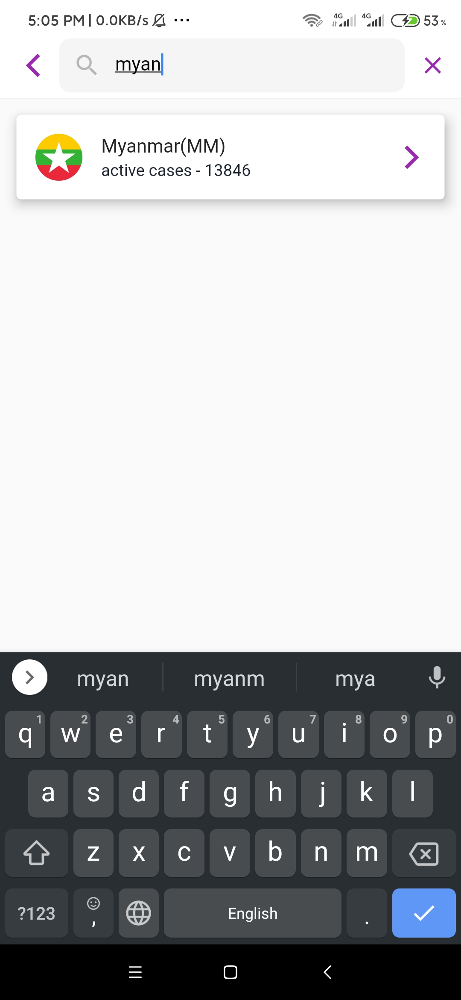 

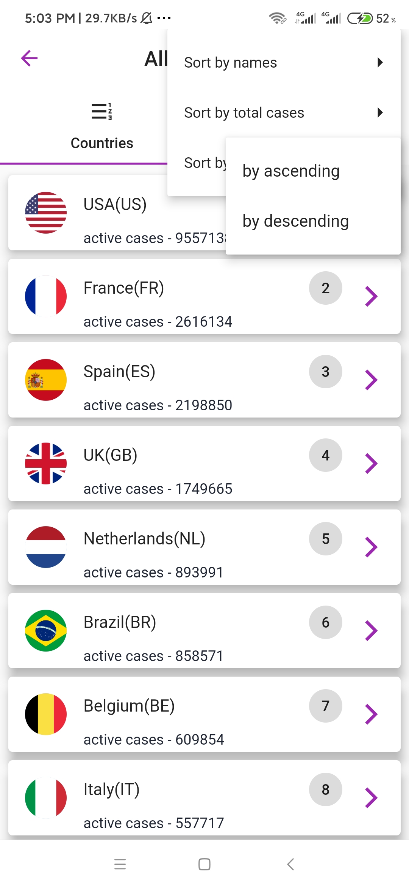
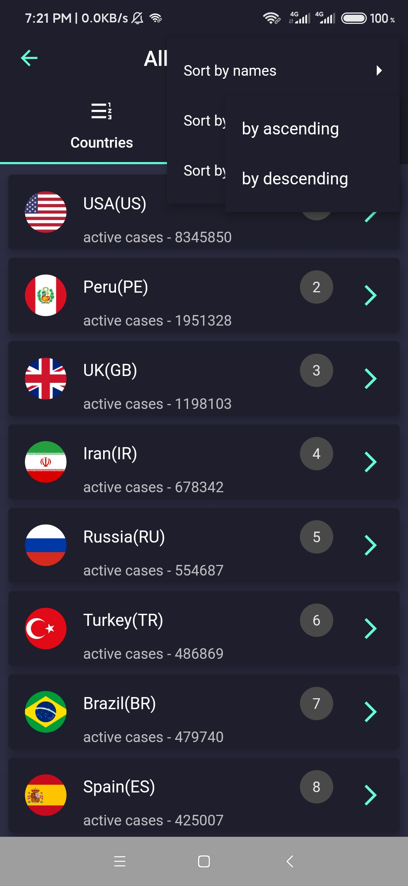

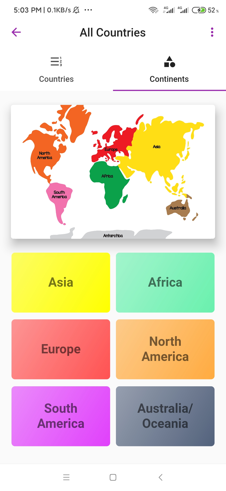 
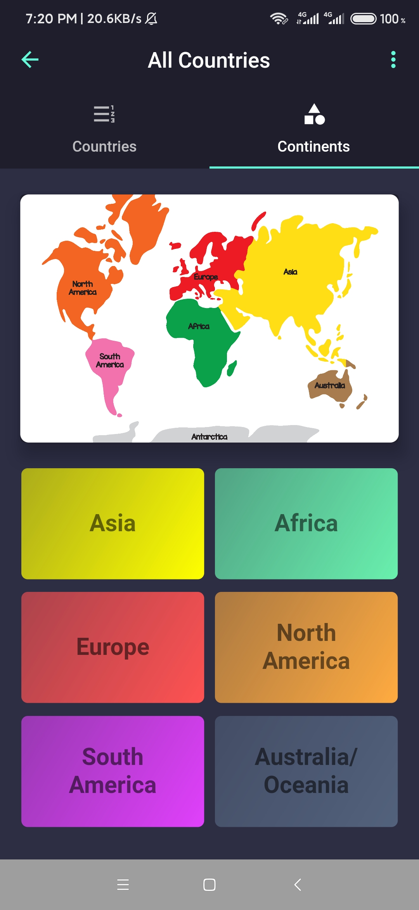

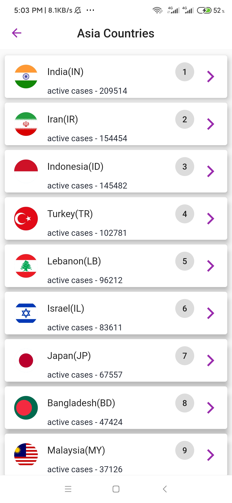 
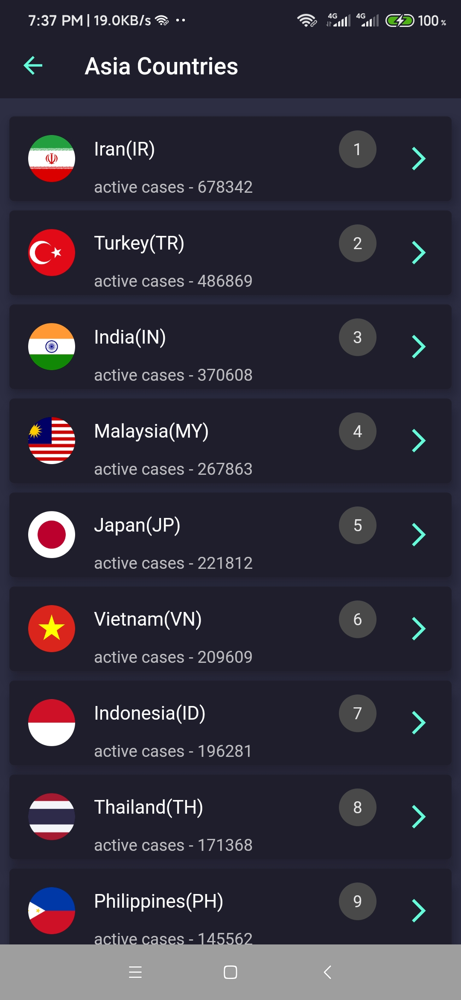 

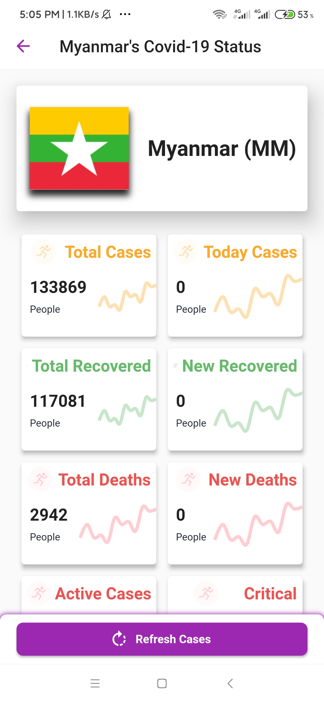 
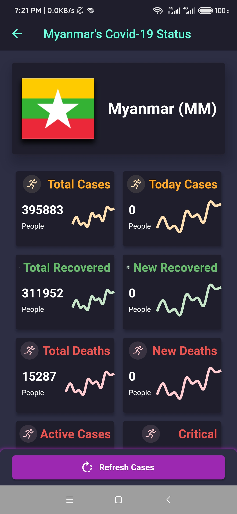 

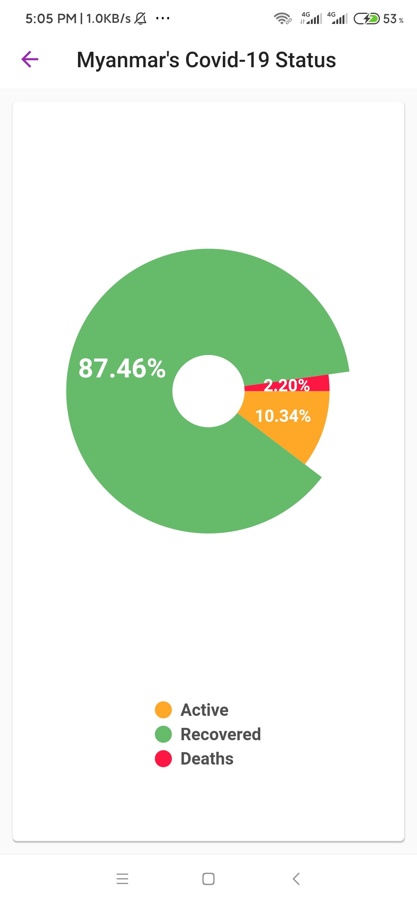 
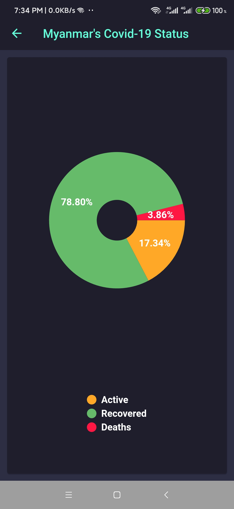

 
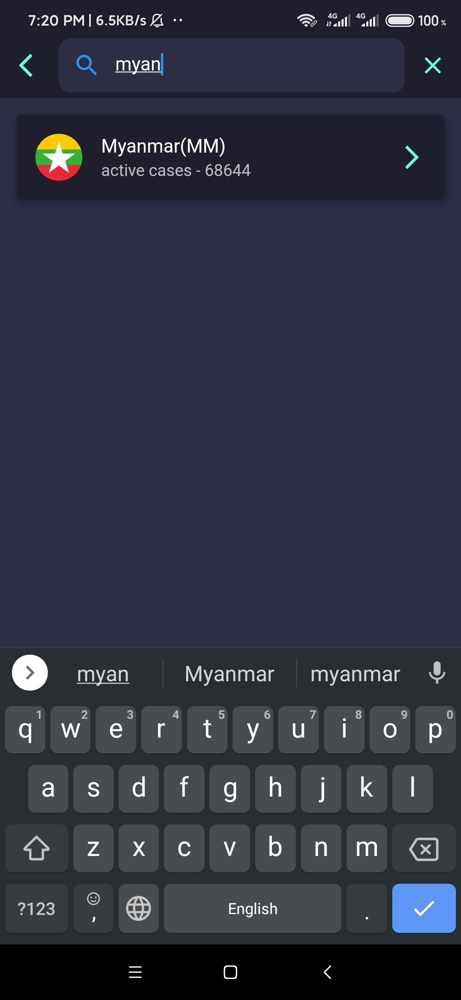 

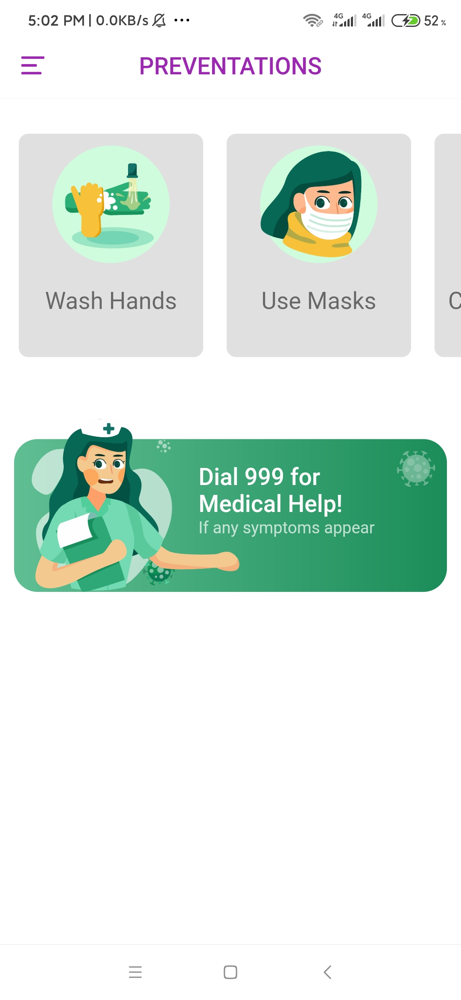 
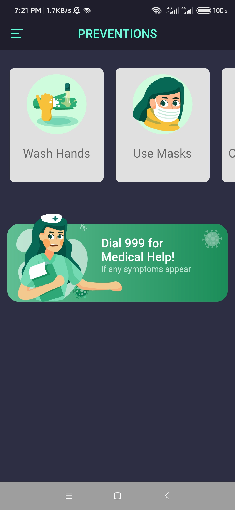 

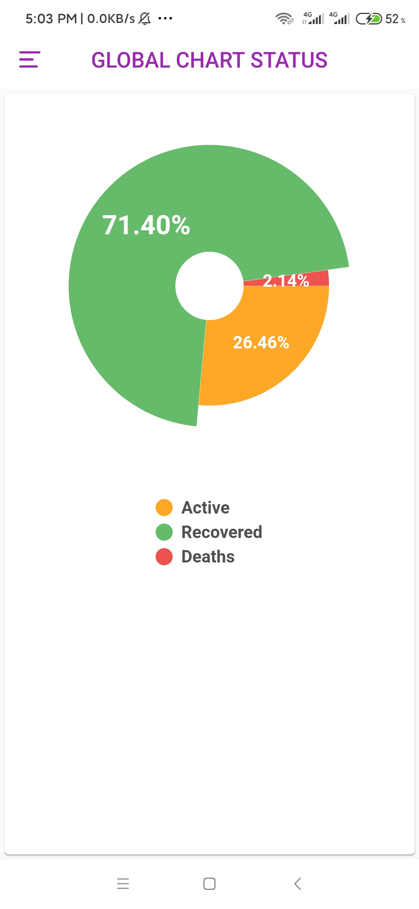
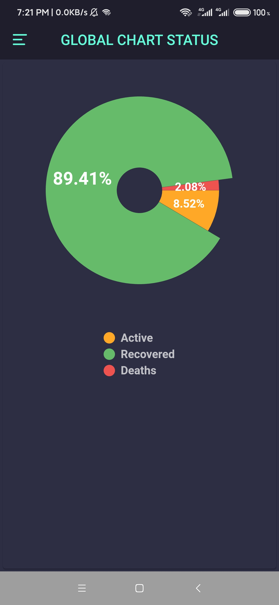

## 🤓 Author
**Hein Arkar** 
